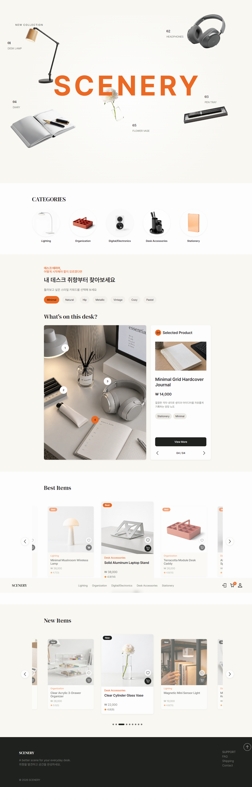
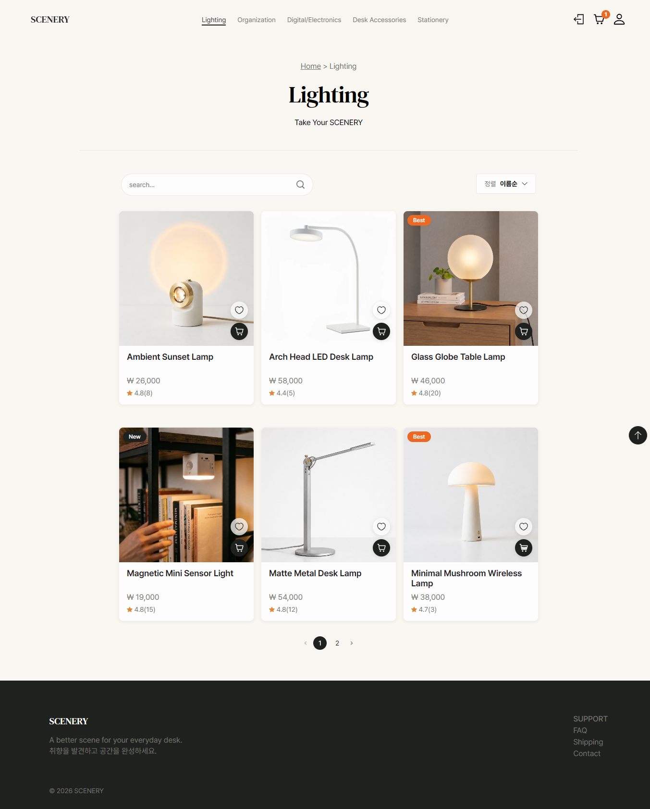
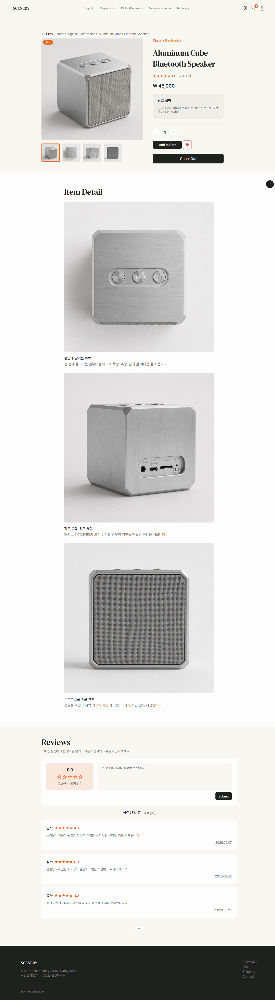
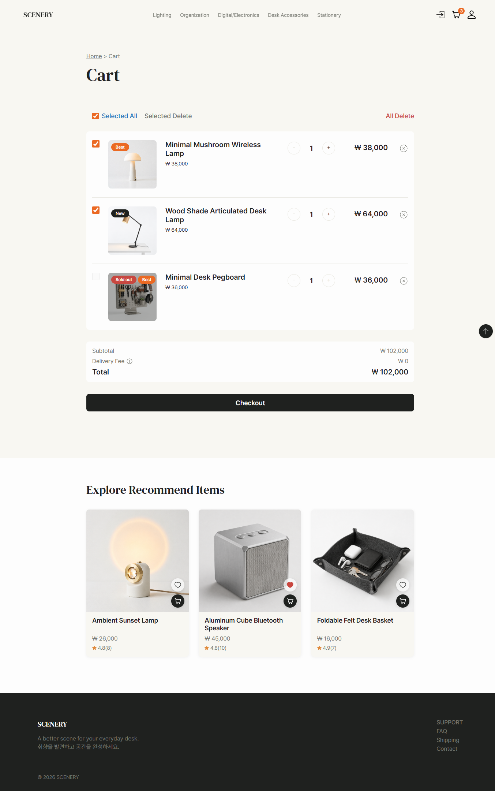
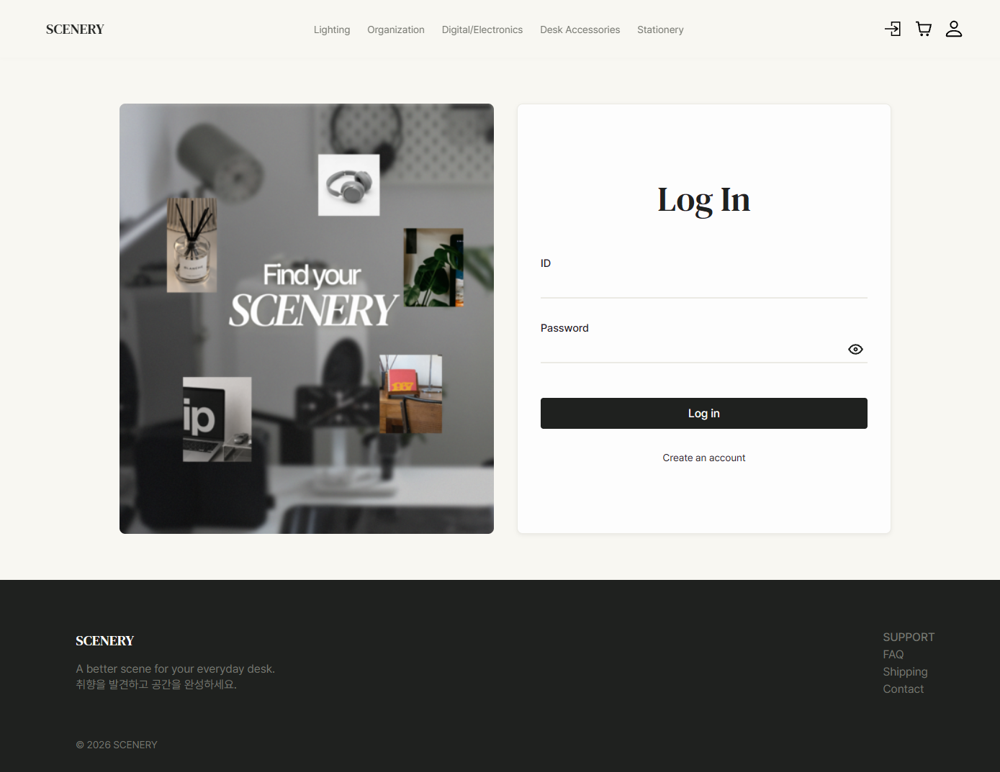
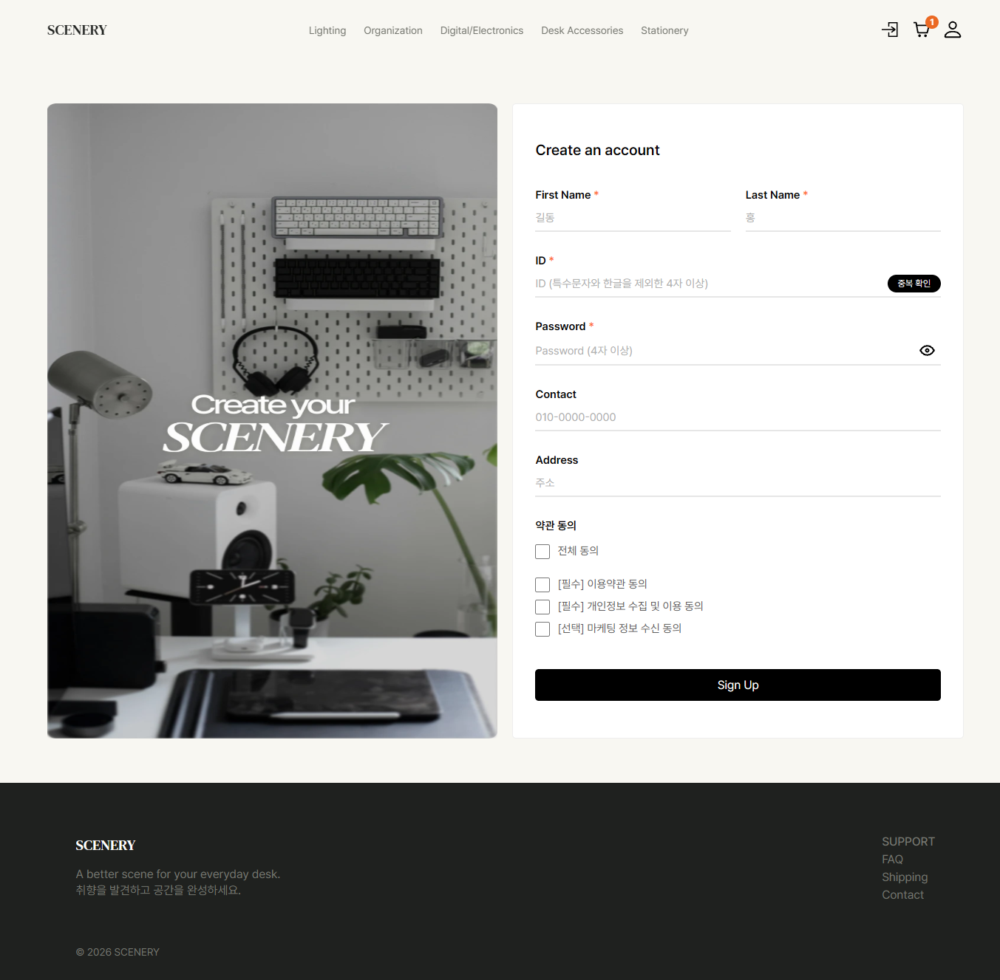
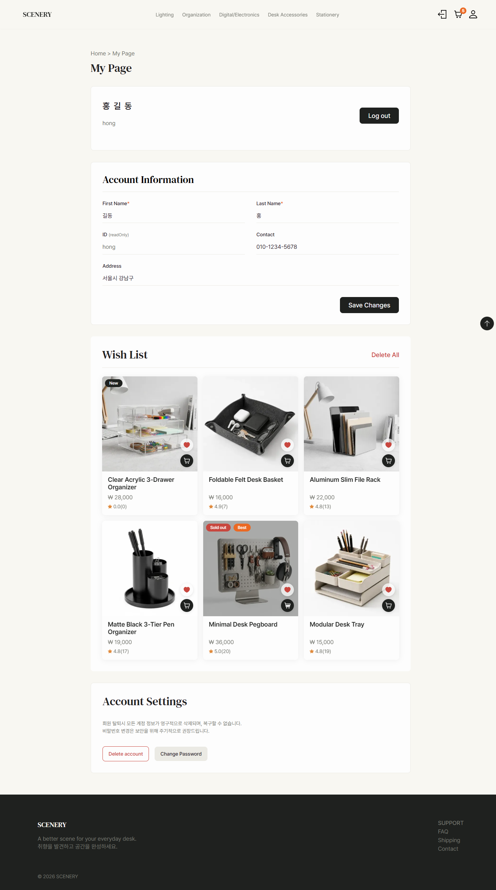
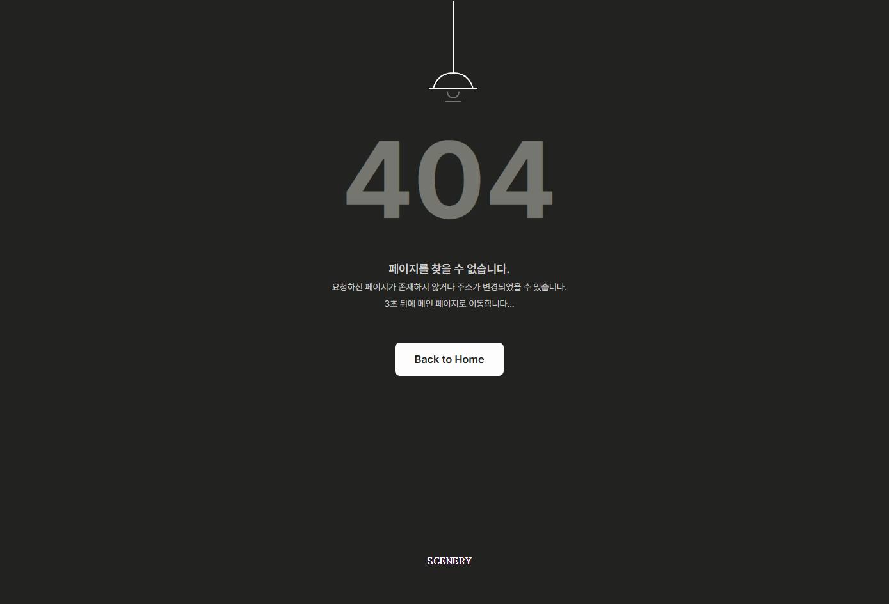

# SCENERY (Deskterior-Scenery)

책상 위 공간을 꾸미는 **데스크테리어(Desk + Interior) 소품 전문 쇼핑몰**입니다.

<br>

## 목차

- [프로젝트 소개](#프로젝트-소개)
- [팀원 및 역할](#팀원-및-역할)
- [개발 기간](#개발-기간)
- [서비스 콘셉트](#서비스-콘셉트)
- [주요 기능](#주요-기능)
- [기술 스택](#기술-스택)
- [프로젝트 파일 구조](#프로젝트-파일-구조)
- [실행 방법](#실행-방법)
- [환경 변수 안내](#환경-변수-안내)
- [주요 화면](#주요-화면)
- [API 사용 방법](#api-사용-방법)
- [트러블슈팅](#트러블슈팅)
- [프로젝트 회고](#프로젝트-회고)

<br>

## 프로젝트 소개

SCENERY는 조명, 수납, 디지털/전자기기, 데스크 액세서리, 문구 등 책상 주변을 꾸미는 소품을 카테고리별 큐레이션으로 취향껏 둘러보고 구매할 수 있는 이커머스 웹 서비스로, 상품 탐색부터 장바구니, 위시리스트(찜), 리뷰 작성까지 일반적인 쇼핑몰의 핵심 흐름을 구현했습니다.

<br>

## 팀원 및 역할

| 이름   | GitHub                                                 | 역할                                        |
| ------ | ------------------------------------------------------ | ------------------------------------------- |
| 최우원 | [@singthesong2](https://github.com/singthesong2)       | 로그인/회원가입, 404 페이지, 마이페이지     |
| 김양왕 | [@gimyangwang-bit](https://github.com/gimyangwang-bit) | 카테고리/상품 목록 페이지, README.MD 작성   |
| 나민우 | [@Naminwoo](https://github.com/buriburi-king)          | 장바구니 페이지, 찜 통신모듈, 호출코드 작성 |
| 김채가 | [@chaegagim-code](https://github.com/chaegagim-code)   | 상세 페이지, 회의록 작성, PPT 제작          |
| 최현옥 | [@ocksoosoo](https://github.com/ocksoosoo)             | 디자인, 홈 페이지, 마이페이지               |

<br>

## 개발 기간

`2026.08.25 ~ 2026.09.15` (약 3주)

<br>

## 서비스 콘셉트

책상 위 풍경(Scenery)을 취향대로 구성한다는 콘셉트로, 카테고리를 다음과 같이 나누어 제공합니다.

- **Lighting** (조명)
- **Organization** (수납/정리)
- **Digital / Electronics** (디지털/전자기기)
- **Desk Accessories** (데스크 액세서리)
- **Stationery** (문구)

- **해결하려는 문제**: 재택근무·홈오피스가 늘면서 책상 꾸미기(데스크테리어) 수요는 커졌는데, 조명/수납/문구/전자기기가 카테고리별로 흩어진 쇼핑몰이 많아 한 번에 취향대로 데스크 셋업을 완성하기 어렵다는 점
- **타겟 사용자**: 재택·1인 오피스 환경을 꾸미고 싶은 2030 자취생/직장인, 미니멀하고 톤온톤인 데스크테리어를 선호하는 사용자
- **차별화 포인트**: 조명·수납·전자기기·액세서리·문구를 하나의 "책상 위 풍경"이라는 콘셉트로 묶어 카테고리 간 자연스러운 연계 쇼핑을 유도하는 큐레이션형 구성

<br>

## 주요 기능

### 메인

- 인터랙티브 히어로 배너
- 스타일별 데스크 큐레이션
- 동적 이미지 슬라이더의 무한 순환 및 페이지 인디케이터
- 모바일 더보기 기능

### 인증

- 회원가입 / 아이디 중복 확인 / 로그인 / 로그아웃
- 새로고침 시 토큰(localStorage) 기반 로그인 상태 자동 복구
- Zod 기반 폼 유효성 검사, 실패 시 흔들림 애니메이션으로 에러 피드백
- 아이디 중복 확인 필수 처리 (미확인 시 가입 불가, 응답 지연 중 값이 바뀌면 stale 응답 무시)

### 상품

- 카테고리별 상품 목록 조회 (페이지네이션, 검색, 정렬/필터 툴바)
- 반응형 상품 그리드 (모바일 2열 / PC·태블릿 3열)
- 상품 상세 페이지 (이미지 갤러리, 상세 설명, BEST/NEW/품절 뱃지)
- 상품 리뷰 목록 조회, 평점 요약(평균 별점)

### 리뷰

- 로그인 사용자의 리뷰 작성 / 수정 / 삭제 (본인 리뷰만)
- 리뷰 4개 이상이면 처음엔 3개만 보여주고 "+"로 전체 펼치기
- 비로그인 상태로 별점/작성 시도 시 로그인 안내 모달로 유도
- 수정한 리뷰는 "(수정됨)" 표시, 작성자가 탈퇴한 리뷰는 "알수없는 회원"으로 익명 처리

### 장바구니

- 상품 담기, 수량 변경, 개별/선택 삭제, 전체 비우기 (전체 비우기는 확인 모달로 실수 방지)
- 비회원도 장바구니 이용 가능(로컬 저장), 로그인 시 기존 장바구니를 서버와 자동 병합(merge)
- 헤더 아이콘의 담긴 상품 개수 뱃지 실시간 동기화
- 상품 썸네일/제목 클릭 시 해당 상품 상세 페이지로 이동
- 빈 장바구니 상태(Empty State) 화면 및 홈으로 이동 연동
- 배송비 규칙: 선택 상품 합계 8만원 이상 무료배송, 미만이면 3,000원 부과
- 선택한 상품만 합계 계산해서 결제, 품절 상품은 전체선택/합계에서 자동 제외되고 결제 버튼도 "Sold Out"으로 변경
- 비회원 결제 시도 / 선택 상품 없음 / 전체 품절 등 예외 상황 시 결제 모달 진입 차단
- 장바구니 하단 추천 상품 3개 노출 (이미 담긴 상품·품절 상품은 자동 제외)
- 처리 결과(성공/실패)는 토스트로 안내
- 체크박스/버튼에 aria-label, 배송비 툴팁에 focus-visible·tabIndex 적용 등 키보드/스크린리더 접근성 처리
- 첫 번째 상품 썸네일은 `fetchPriority="high"` + eager 로딩, 나머지는 lazy 로딩 (LCP 최적화)
- 이미지 리사이징 프록시로 용량 최적화, 로드 전 placeholder 텍스트 → 로드 완료 시 페이드인 전환

### 위시리스트(찜)

- 상품 찜하기/취소 (비회원도 가능, 로컬 저장)
- 로그아웃 시 찜 목록 초기화
- 처음엔 6개만 보여주고 "+"로 3개씩 더보기
- 위시리스트 전체 삭제 (확인 모달)
- 목록 조회 실패 시 에러 안내 + Retry 재시도 버튼

### 결제

- 구매 확인 모달을 통한 결제 진행 플로우
- 상세 페이지에서 장바구니 없이 바로 구매(즉시 결제) 가능
- 실제 PG 연동 없이 확인 모달 기반의 결제 시뮬레이션 플로우

### 마이페이지

- 회원 정보 조회 및 이름/연락처/주소 수정 (Zod 검증, 저장 실패 시 흔들림 애니메이션)
- 비밀번호 변경 (현재/새 비밀번호 입력, 각각 표시/숨기기 토글, 현재와 동일한 비밀번호로는 변경 불가)
- 회원 탈퇴 (확인 모달, 탈퇴 시 장바구니/위시리스트/로그인 정보 초기화)
- 위시리스트(찜) 목록 확인 및 관리 (자세한 기능은 [위시리스트(찜)](#위시리스트찜) 참고)

### 공통 UX

- 반응형 헤더 및 모바일 햄버거 메뉴
- 전역 토스트 알림(성공/실패), 페이지 전환 로딩 인디케이터
- 스크롤 위치 복원, 페이지 상단으로 이동시키는 플로팅 버튼
- 커스텀 404 페이지 (5초 카운트다운 후 자동 홈 이동)
- OS "동작 줄이기(reduce motion)" 설정을 존중하는 전역 애니메이션 처리
- 키보드 접근성 (커스텀 드롭다운 등에 focus-visible 아웃라인, aria-expanded/aria-hidden 처리)
- 현재 페이지의 위치 표시 및 상위 페이지 이동 링크를 제공하는 브레드 크럼(bread crumb)
- zustand 전역변수를 활용해서 유저 정보 처리 및 페이지 loading 화면 처리
- REST API 이용한 서버와 클라이언트 통신 처리
- 각 페이지 Router로 연결 및 분리
- Outlet 이용해 Header와 페이지내용, footer로 분리되는 페이지 틀 제작
- 아이폰 노치 및 홈 인디케이터 안전지대 env(safe-area-inset) 추가
- transform변화가 있는곳에 willChange 추가
- lighthouse 점수 개선

<br>

## 기술 스택

**Frontend**

- React 19 (React Compiler 적용)
- Vite 8 (Rolldown 기반)
- React Router 8

**상태 관리 / 데이터 패칭**

- Zustand (+ `persist` 미들웨어)

**스타일링**

- Emotion (`@emotion/react`, `@emotion/styled`)

**폼 / 검증**

- Zod

**UI / 기타**

- Tabler Icons React
- Motion (애니메이션)
- React Spinners (로딩 인디케이터)
- React Toastify (토스트 알림)
- Pretendard / DM Serif Text 웹폰트 (CDN)

**Lint / 개발 도구**

- ESLint (`eslint-plugin-react-hooks`, `eslint-plugin-react-refresh`)
- Babel + `babel-plugin-react-compiler`

**API 문서**

- Swagger (OpenAPI)

<br>

## 프로젝트 파일 구조

```
Deskterior-Scenery/
├── docs/
│   └── screenshots/                # README에 쓰인 스크린샷
├── public/
│   ├── favicon.svg
│   ├── icons.svg
│   └── robots.txt
├── src/
│   ├── api/                     # 서버 통신 (fetch 래퍼 + 도메인별 API)
│   │   ├── authApi.js
│   │   ├── cartApi.js
│   │   ├── categoriesApi.js
│   │   ├── clientApi.js         # 공통 fetch 래퍼 (인증 헤더, 에러 처리)
│   │   ├── mainApi.js
│   │   ├── productsApi.js
│   │   ├── reviewsApi.js
│   │   └── wishlistApi.js
│   ├── assets/                  # 이미지 / 영상 리소스
│   ├── components/
│   │   ├── cart/                # 장바구니 아이템, 요약, 추천 상품
│   │   ├── common/               # Modal, Toast, Loading, SafeImage 등 공통 컴포넌트
│   │   ├── home/                 # 홈 화면 섹션 (Hero, 카테고리, 큐레이션 등)
│   │   ├── icons/                 # SVG 아이콘 모음
│   │   ├── layout/               # Header, Footer
│   │   ├── product/               # 상품 카드, 상세, 갤러리, 구매 박스 등
│   │   ├── review/                 # 리뷰 작성/목록/요약
│   │   └── AuthForm.jsx
│   ├── constants/                 # 목업 상수 데이터
│   ├── data/                      # 카테고리, 상품, 정렬 옵션 등 정적 데이터
│   ├── hook/                      # 커스텀 훅
│   │   ├── useCategoryPageParams.jsx
│   │   ├── useCategoryProducts.jsx
│   │   ├── useIsMobile.jsx
│   │   ├── usePageLoading.jsx
│   │   └── useResponsiveRowSize.jsx
│   ├── pages/
│   │   ├── Cart/CartPage.jsx
│   │   ├── Category/CategoryPage.jsx
│   │   ├── Home/HomePage.jsx
│   │   ├── Product/ProductDetailPage.jsx
│   │   ├── LoginForm.jsx
│   │   ├── SignupForm.jsx
│   │   ├── MyPage.jsx
│   │   ├── WishListSection.jsx     # 마이페이지 내 위시리스트 섹션
│   │   ├── NotFoundPage.jsx
│   │   └── commonLayout.jsx        # 공통 레이아웃 (Header/Footer + Outlet)
│   ├── schema/                     # Zod 스키마 (회원가입/로그인 검증)
│   ├── store/                      # Zustand 스토어 (인증, 로딩, 장바구니, 카테고리, 상품 카탈로그, 위시리스트)
│   ├── styles/                     # Emotion 스타일 (기능별 하위 폴더로 분리)
│   ├── utils/
│   │   ├── imageProxy.js           # 이미지 리사이징 프록시(wsrv.nl) URL 변환
│   │   └── preloadingImages.jsx
│   ├── App.jsx                     # 라우트 정의
│   └── main.jsx                    # 엔트리 포인트
├── .env.example
├── eslint.config.js
├── index.html
├── package.json
└── vite.config.js
```

<br>

## 실행 방법

```bash
# 1. 저장소 클론
git clone https://github.com/singthesong2/Deskterior-Scenery.git
cd Deskterior-Scenery

# 2. 의존성 설치
npm install

# 3. 환경 변수 설정 (.env 파일 생성, 아래 "환경 변수 안내" 참고)
cp .env.example .env

# 4. 개발 서버 실행
npm run dev
```

그 외 스크립트

```bash
npm run build     # 프로덕션 빌드 (dist/ 생성)
npm run preview   # 빌드 결과 미리보기
npm run lint      # ESLint 검사
```

<br>

## 환경 변수 안내

`.env.example`을 참고하여 프로젝트 루트에 `.env` 파일을 생성합니다.

| 변수명              | 설명                       | 예시                                        |
| ------------------- | -------------------------- | ------------------------------------------- |
| `VITE_API_BASE_URL` | 백엔드 API 서버의 base URL | `https://api.example.com/api/{기수}/{team}` |

> 민감한 실제 값을 README에 작성하지 않도록 주의합니다. 실제 값은 `.env` 파일에만 두고 커밋하지 않습니다.

<br>

## 주요 화면

| 화면                        | 이미지                                                 |
| --------------------------- | ------------------------------------------------------ |
| 홈                          |                    |
| 카테고리(상품 목록)         |              |
| 상품 상세                   |   |
| 장바구니                    |              |
| 로그인                      |                   |
| 회원가입                    |            |
| 모바일 반응형(홈)           |  |
| 마이페이지(위시리스트 포함) |              |
| 404 페이지                  |             |

<br>

## API 사용 방법

모든 요청은 `src/api/clientApi.js`의 공통 fetch 래퍼를 통해 나가며, 로그인 토큰이 있으면 `Authorization: Bearer {token}` 헤더가 자동으로 붙습니다.

Swagger 문서: 팀 노션/Swagger는 별도 공유

### 인증 (`/auth`)

| Method | Endpoint         | 설명                      |
| ------ | ---------------- | ------------------------- |
| POST   | `/auth/signup`   | 회원가입                  |
| POST   | `/auth/check-id` | 아이디 중복 확인          |
| POST   | `/auth/login`    | 로그인                    |
| POST   | `/auth/logout`   | 로그아웃                  |
| GET    | `/auth/me`       | 로그인한 사용자 정보 조회 |
| PATCH  | `/auth/me`       | 회원 정보 수정            |
| PATCH  | `/auth/password` | 비밀번호 변경             |
| DELETE | `/auth/me`       | 회원 탈퇴                 |

### 상품 (`/products`)

| Method | Endpoint                           | 설명           |
| ------ | ---------------------------------- | -------------- |
| GET    | `/products?category=&page=&limit=` | 상품 목록 조회 |
| GET    | `/products/{productId}`            | 상품 상세 조회 |
| POST   | `/products`                        | 상품 등록      |

`POST /products` 요청 body 예시

```json
{
  "name": "3-in-1 Foldable Wireless Charger",
  "categoryId": "digital-electronics",
  "price": 48000,
  "imageUrl": "https://i.ibb.co/MxtphN8v/17.webp",
  "description": "폰, 워치, 이어폰을 슬림하게 거치하며 동시 충전하는 무선 스테이션",
  "badge": [],
  "stock": 10
}
```

### 카테고리 (`/categories`)

| Method | Endpoint      | 설명               |
| ------ | ------------- | ------------------ |
| GET    | `/categories` | 카테고리 목록 조회 |

### 리뷰 (`/products/{productId}/reviews`, `/reviews`)

| Method | Endpoint                        | 설명                       |
| ------ | ------------------------------- | -------------------------- |
| GET    | `/products/{productId}/reviews` | 리뷰 목록 + 평균 평점 조회 |
| POST   | `/products/{productId}/reviews` | 리뷰 작성 (로그인 필요)    |
| PATCH  | `/reviews/{reviewId}`           | 리뷰 수정 (작성자만)       |
| DELETE | `/reviews/{reviewId}`           | 리뷰 삭제 (작성자만)       |

### 장바구니 (`/cart`)

| Method | Endpoint                   | 설명                    |
| ------ | -------------------------- | ----------------------- |
| GET    | `/cart`                    | 장바구니 전체 조회      |
| POST   | `/cart/items`              | 상품 담기               |
| PATCH  | `/cart/items/{cartItemId}` | 수량 변경               |
| DELETE | `/cart/items/{cartItemId}` | 개별 상품 삭제          |
| DELETE | `/cart/items`              | 선택 상품 삭제          |
| DELETE | `/cart`                    | 장바구니 전체 삭제      |
| GET    | `/cart/count`              | 장바구니 상품 개수 조회 |

### 위시리스트(찜) (`/wishlist`)

| Method | Endpoint                | 설명                 |
| ------ | ----------------------- | -------------------- |
| GET    | `/wishlist`             | 위시리스트 전체 조회 |
| POST   | `/wishlist/{productId}` | 찜하기               |
| DELETE | `/wishlist/{productId}` | 찜 취소              |
| DELETE | `/wishlist`             | 위시리스트 전체 삭제 |

<br>

## 트러블슈팅

- **상품 카드 하나에 뱃지·버튼·리뷰 이동까지 몰아넣으면서 꼬인 문제**
  이미지, 품절/BEST/NEW 뱃지, 찜/장바구니 버튼, 상품명·평점(리뷰 이동) 링크를 카드 하나에 모두 넣다 보니 쌓임 순서와 클릭 영역이 자주 충돌했습니다. 겹치는 요소마다 z-index를 정리하고, 클릭이 필요 없는 오버레이는 `pointer-events: none`으로 밑의 링크에 클릭을 그대로 전달해 해결했습니다.

- **LCP를 7초 이상 지연시키던 블로킹 이미지 프리로드 문제**
  상세 페이지에서 이미지를 미리 불러오려던 `preloadingImages` 호출이 오히려 메인 콘텐츠 렌더링을 막아 LCP를 7초 이상 지연시켰습니다. 해당 블로킹 프리로드 호출을 제거해 해결했습니다.

- **jsDelivr 폰트 404 및 LCP 지연 문제**
  GitHub 경로로 폰트를 서빙하던 jsDelivr CDN이 대용량 파일 제한에 걸려 폰트 요청이 404로 실패했고, 구글 폰트 `<link>` 방식은 2단계 네트워크 요청을 거쳐 폰트 로딩이 지연(FOUT)됐습니다. CDN 경로를 npm 레지스트리 기반으로 바꿔 404를 해결하고, 구글 폰트 `<link>` 대신 전역 CSS의 `@font-face`로 가변 폰트를 직접 선언해 네트워크 왕복 횟수를 줄여 LCP를 개선했습니다.

- **로그인 시 비회원 장바구니 데이터가 유실되는 문제**
  비회원 상태에서 장바구니에 상품을 담고 로그인하면, 로컬 데이터가 사라지거나 서버 데이터에 덮어씌워져 유실되는 문제가 있었습니다. 로그인 직후 로컬 데이터를 서버로 이관하는 `mergeLocalCartToServer` 함수를 구현해, 서버 통신에 성공한 아이템만 순차적으로 로컬에서 제거하도록 해 네트워크 에러가 나도 데이터가 보존되게 했습니다.

- **선택 상품 체크박스 동기화 로직 단순화**
  '선택된 상품 ID'를 배열로 추적하면 상품이 추가/삭제될 때마다 배열을 순회하며 동기화해야 해서 상태 관리가 복잡해졌습니다. 반대로 '선택 해제된 상품(unselectedItemIds)'만 추적하는 Opt-out 방식으로 바꿔 새로 담은 상품은 자동으로 체크되게 하고, Zustand `persist`로 새로고침 후에도 체크 상태가 유지되게 했습니다.

- **병렬 데이터 조회 중 페이지 이탈 시 메모리 누수 방지**
  장바구니 데이터와 실시간 상품 정보를 병렬로 조회하는 도중 사용자가 페이지를 벗어나면, 이미 언마운트된 컴포넌트에 상태 업데이트를 시도해 메모리 누수 경고가 발생했습니다. `useEffect` 내부에 `alive` 클린업 플래그를 둬서, 페이지 이탈 후에는 비동기 응답이 와도 상태 업데이트를 하지 않도록 막았습니다.

- **로컬스토리지 오염 시 크래시 및 렌더링 무한 루프 버그**
  로컬 스토리지 데이터가 손상됐을 때 파싱 과정에서 앱이 그대로 크래시됐고, 별개로 이벤트 핸들러를 `onClick={setState(true)}`처럼 렌더링 시점에 즉시 호출해버려 무한 루프가 발생하는 버그도 있었습니다. 파싱은 `try-catch`로 감싸 실패 시 빈 배열을 반환하게 하고, 이벤트 핸들러는 `onClick={() => setState(true)}` 형태의 콜백으로 고쳐 해결했습니다.

<br>

## 프로젝트 회고

- **김양왕**
  - 느낀 점
    수업 시간에 배운 내용을 실제로 실무에 연계하는 과정은 프로젝트 기간 내내 어렵고 힘든 순간의 연속이었습니다. 특히 카테고리/상품 목록 페이지를 맡으면서 상품 카드 하나에 이미지, 뱃지, 찜/장바구니 버튼, 가격, 평점까지 여러 요소를 함께 구성하는 게 가장 힘들었는데, 손이 많이 가는 문제를 하나씩 원인부터 추적해서 고쳐나가는 과정에서 실력이 붙는 걸 스스로 체감할 수 있었습니다. 안 했다면 얻지 못했을 값진 경험이라는 걸 알면서도, 지금은 선뜻 하길 잘했다는 말이 나오지 않을 만큼 피로와 힘듦이 남아 있습니다만, 분명하게 이전보다 큰 성장을 했다고는 자신 있게 말할 수 있습니다. 이 과정을 겪으며 결국 이 분야는 한 번 해봤는지, 이걸 아는지 모르는지에 따라 차이가 크다는 걸 크게 느꼈고, 그래서 앞으로는 머리로만 아는 것에 그치지 않고 더 많이 부딪히고 직접 해보면서 익혀나가는 개발자가 되고 싶습니다.

  - 아쉬운 점
    언제나처럼 저의 실력과 경험 부족이 가장 아쉽습니다. 다른 팀원분들에게 많은 도움이 되고 싶었지만 그러지 못한 저의 현실에 못내 아쉬운 마음이 들었고, 특히 문제 상황을 마주했을 때 원인을 빠르게 좁혀나가는 순발력이 아직 부족하다고 느꼈습니다. 또한 정해진 기간 안에 일을 처리해야 한다는 조급함 때문에 다양한 관점에서 충분히 고민하고 머릿속으로 미리 그려볼 여유 없이 서둘러 결정을 내리다 보니, 프로젝트 후반까지 계속 수정을 반복하게 된 점도 아쉬웠습니다. 그럼에도 완벽할 수도 모든 걸 다 담을 수도 없다고 생각하기 때문에 이 정도의 아쉬움은 자연스러운 부분이라고 생각합니다.

  - 다음 프로젝트에 적용하고 싶은 점
    기능을 먼저 만들고 부딪히기보다, 문서와 예제를 조금 더 꼼꼼히 찾아보고 시작해서 이번처럼 만들면서 겪는 시행착오를 줄이고 싶습니다. 기능적으로는 전체 상품을 한눈에 볼 수 있는 화면과 다크 모드, 할인 상품 섹션, 다양한 필터를 추가하고 싶습니다. 특히 지금 카테고리/상품 목록 페이지에는 총 상품 개수 표시조차 없고 가격대로 좁혀 볼 수 있는 필터도 없어서, 다음엔 이런 기본적인 부분부터 꼼꼼히 챙기고 싶습니다.

- **김채가**
  - 완성도 평가: 10점 / 10점
  - 잘한 부분과 아쉬운 점
    팀원과의 소통이 잘한 부분이었고, 아쉬운 점은 딱히 없었습니다.
  - 추후 개선점이나 보완할 점
    상세 페이지 UI 디테일 부분을 더 다듬고 싶습니다.
  - 느낀 점이나 경험한 성과
    API 연결이 처음이라 어려웠지만 강사님 덕분에 잘 넘어간 것 같습니다.

- **최현옥**
  - 잘한 부분과 아쉬운 점: 디자인 시안 그대로 완성한 점, 그리고 필수 구현 사항에 더하여 웹사이트의 컨셉과 분위기에 맞는 추가 기능까지 구현한 점은 만족스러우나, 아직 아이디어를 로직으로 바로 설계할 역량이 부족한 점이 아쉽습니다.
  - 추후 개선점이나 보완할 점: 메인 페이지의 애니메이션을 보완하여 성능을 더 올리고, 컴포넌트 단위를 더 명확하고 세밀하게 쪼개어 재사용 가능한 범위를 늘리면 좋을 것 같습니다.
  - 느낀 점이나 경험한 성과: 성능 테스트를 진행하는 과정에서 마음만큼 성능 향상이 되지 않았던 경험을 통해 접근성, 성능, 로딩 속도 등 다방면을 고려해야 한다는 점을 깨달았습니다. 디자인과 기능이 갖춰진 웹사이트를 만들어볼 수 있었고 팀원들과 협업도 잘 되어서 인상적인 프로젝트 경험으로 남을 것 같습니다.

- **나민우**
  - 느낀 점
    처음에는 4주라는 기간에 5명이 함께 진행하는 프로젝트라서 생각보다 빠르게 완성할 수 있을 거라고 생각했습니다. 하지만 실제로 배운 이론을 프로젝트에 적용해 보니 예상했던 것보다 훨씬 많은 시간과 고민이 필요했습니다. 특히 처음 사용해 본 전역 상태 관리 라이브러리인 Zustand를 익히고 프로젝트에 적용하는 과정에서 시행착오가 있었지만, 그 과정에서 공통 컴포넌트와 상태를 어떻게 구성하고 관리해야 하는지 많이 배울 수 있었습니다. 개인적으로 부족한 부분을 직접 체감하기도 했지만, 팀원들과 서로 알고 있는 내용을 공유하고 부족한 부분을 보완해 가면서 혼자 개발할 때와는 다른 협업의 재미도 느낄 수 있었습니다. 단순히 기능을 완성하는 것뿐만 아니라 서로 의견을 주고받으며 하나의 결과물을 만들어가는 과정이 인상 깊었고, 여러모로 배울 점이 많았던 프로젝트였습니다.

  - 아쉬운 점
    프로젝트 초반에 폴더와 파일 구조를 조금 더 구체적으로 정리한 뒤 개발을 시작했으면 이후 코드를 관리하는 데 훨씬 수월했을 것 같다는 아쉬움이 남습니다. 특히 위시리스트 API 명세를 정리하고 통신 로직을 처음 설계하면서 예상보다 많은 시행착오가 있었고, 이 과정에서 일정이 조금씩 밀리기도 했습니다. 이전 1, 2차 프로젝트보다 4주라는 비교적 긴 시간이 주어졌지만, 그만큼 여유가 있다고 생각했던 부분도 있어서 일정 관리가 충분하지 못했던 것 같습니다. 결국 프로젝트 후반에는 기능 구현과 수정에 집중하게 되었고, 코드 리팩토링이나 모바일 환경에서의 LCP 개선과 같은 성능 최적화를 충분히 진행하지 못한 점이 가장 아쉽습니다.

  - 다음 프로젝트에 적용하고 싶은 점
    이번 프로젝트에서는 React와 JavaScript 기반으로 개발을 진행했는데, 다음 프로젝트에서는 TypeScript를 도입해 보고 싶습니다. 정적 타입을 활용하면 개발 과정에서 발생할 수 있는 오류를 미리 확인하고, 코드의 안정성과 유지보수성도 높일 수 있을 것 같기 때문입니다. 또한 이번에는 기능을 구현하는 데 집중하다 보니 전체적인 비즈니스 로직과 데이터 흐름을 충분히 정리하지 못한 상태에서 개발을 시작한 부분도 있었습니다. 다음에는 코드를 먼저 작성하기보다 전체적인 구조와 데이터 흐름을 먼저 정리한 후 개발하는 습관을 들이고 싶습니다. 마지막으로 이번 프로젝트에서 장바구니 도메인을 직접 구현하면서 쌓은 경험을 바탕으로, 다음 프로젝트에서는 결제 모듈 연동이나 관리자 페이지처럼 조금 더 복잡하고 다양한 기능에도 도전해 보고 싶습니다.

- **최우원**
  - 완성도 평가: 10점 / 10점

  - 잘한 부분 아쉬운 점
    팀원들과 아무 문제 없이 프로젝트를 같이 진행하면서 완성된 결과물이 나온게 가장 잘한부분이고, 디자인대로 결과물이 나와 만족스럽고 초반 기획 회의에서 나온 기능 구현을 거의 다 해서 만족스러움

  - 아쉬운 점
    시간이 더 있었으면 추가하고싶은 기능들이 몇개 더 있는데 그걸 못한게 조금 아쉬움

  - 추후 개선점이나 보완할 점
    이미지 등 API에서 정보를 불러오는 과정에서 로직구현을 자연스럽게 할려고 했지만 더 개선사항이 있을거 같단 생각이 들고 이것을 더 보완 하고싶음

  - 느낀 점이나 경험한 성과
    이론수업하다가 직접 프로젝트를 해보니 배운 내용이 이런거구나를 더 확실히 알게 된 경험이였고, 팀원들과 같이 잘 완성된 결과물 자체가 좋은 성과였음
